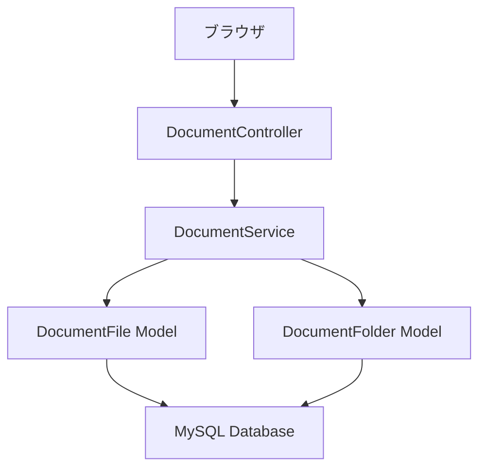

# 設計書

## 概要

ドキュメントタブの削除・編集機能をシンプルに実装します。既存のDocumentControllerとDocumentServiceを活用し、最小限の変更でボタンベースの操作を追加します。

## アーキテクチャ

### システム構成



### 既存システムの活用

- **DocumentController**: 既存の削除・編集メソッドを使用
- **DocumentService**: 既存のdeleteFile, deleteFolder, renameFileメソッドを使用
- **JavaScript**: app-unified.jsのDocumentManagerクラスを拡張

## コンポーネントとインターフェース

### フロントエンド設計

#### ボタン配置
```html
<!-- ファイル行 -->
<tr>
  <td>ファイル名</td>
  <td>サイズ</td>
  <td>更新日</td>
  <td>
    <button class="btn btn-sm btn-outline-primary edit-file-btn" data-file-id="123">
      <i class="fas fa-edit"></i>
    </button>
    <button class="btn btn-sm btn-outline-danger delete-file-btn" data-file-id="123">
      <i class="fas fa-trash"></i>
    </button>
  </td>
</tr>

<!-- フォルダ行 -->
<tr>
  <td>フォルダ名</td>
  <td>-</td>
  <td>更新日</td>
  <td>
    <button class="btn btn-sm btn-outline-primary edit-folder-btn" data-folder-id="456">
      <i class="fas fa-edit"></i>
    </button>
    <button class="btn btn-sm btn-outline-danger delete-folder-btn" data-folder-id="456">
      <i class="fas fa-trash"></i>
    </button>
  </td>
</tr>
```

#### モーダルダイアログ
```html
<!-- 名前変更モーダル -->
<div class="modal fade" id="rename-modal">
  <div class="modal-dialog">
    <div class="modal-content">
      <div class="modal-header">
        <h5 class="modal-title">名前変更</h5>
      </div>
      <div class="modal-body">
        <input type="text" class="form-control" id="new-name" placeholder="新しい名前">
      </div>
      <div class="modal-footer">
        <button type="button" class="btn btn-secondary" data-bs-dismiss="modal">キャンセル</button>
        <button type="button" class="btn btn-primary" id="save-rename-btn">保存</button>
      </div>
    </div>
  </div>
</div>
```

### JavaScript設計

#### DocumentManagerクラスの拡張
```javascript
class DocumentManager {
  // 既存のメソッド...

  // 削除機能
  async handleDeleteFile(fileId) {
    const confirmed = await AppUtils.confirmDialog('このファイルを削除しますか？', '削除確認', { type: 'delete' });
    if (!confirmed) return;

    try {
      const response = await fetch(`/facilities/${this.facilityId}/documents/files/${fileId}`, {
        method: 'DELETE',
        headers: { 'X-CSRF-TOKEN': this.csrfToken }
      });
      
      if (response.ok) {
        AppUtils.showToast('ファイルを削除しました', 'success');
        this.refreshDocumentList();
      }
    } catch (error) {
      AppUtils.showToast('削除に失敗しました', 'error');
    }
  }

  async handleDeleteFolder(folderId) {
    const confirmed = await AppUtils.confirmDialog('このフォルダを削除しますか？', '削除確認', { type: 'delete' });
    if (!confirmed) return;

    try {
      const response = await fetch(`/facilities/${this.facilityId}/documents/folders/${folderId}`, {
        method: 'DELETE',
        headers: { 'X-CSRF-TOKEN': this.csrfToken }
      });
      
      if (response.ok) {
        AppUtils.showToast('フォルダを削除しました', 'success');
        this.refreshDocumentList();
      }
    } catch (error) {
      AppUtils.showToast('削除に失敗しました', 'error');
    }
  }

  // 編集機能
  async handleRenameFile(fileId, currentName) {
    const newName = await this.showRenameModal(currentName);
    if (!newName) return;

    try {
      const response = await fetch(`/facilities/${this.facilityId}/documents/files/${fileId}/rename`, {
        method: 'PUT',
        headers: {
          'Content-Type': 'application/json',
          'X-CSRF-TOKEN': this.csrfToken
        },
        body: JSON.stringify({ name: newName })
      });
      
      if (response.ok) {
        AppUtils.showToast('ファイル名を変更しました', 'success');
        this.refreshDocumentList();
      }
    } catch (error) {
      AppUtils.showToast('名前変更に失敗しました', 'error');
    }
  }

  async handleRenameFolder(folderId, currentName) {
    const newName = await this.showRenameModal(currentName);
    if (!newName) return;

    try {
      const response = await fetch(`/facilities/${this.facilityId}/documents/folders/${folderId}`, {
        method: 'PUT',
        headers: {
          'Content-Type': 'application/json',
          'X-CSRF-TOKEN': this.csrfToken
        },
        body: JSON.stringify({ name: newName })
      });
      
      if (response.ok) {
        AppUtils.showToast('フォルダ名を変更しました', 'success');
        this.refreshDocumentList();
      }
    } catch (error) {
      AppUtils.showToast('名前変更に失敗しました', 'error');
    }
  }

  showRenameModal(currentName) {
    return new Promise((resolve) => {
      const modal = document.getElementById('rename-modal');
      const input = document.getElementById('new-name');
      const saveBtn = document.getElementById('save-rename-btn');
      
      input.value = currentName;
      
      const modalInstance = new bootstrap.Modal(modal);
      modalInstance.show();
      
      saveBtn.onclick = () => {
        const newName = input.value.trim();
        if (newName && newName !== currentName) {
          resolve(newName);
        } else {
          resolve(null);
        }
        modalInstance.hide();
      };
      
      modal.addEventListener('hidden.bs.modal', () => {
        resolve(null);
      }, { once: true });
    });
  }
}
```

### バックエンド設計

#### 既存のルートを活用
```php
// routes/web.php - 既存のルートを使用
Route::delete('/facilities/{facility}/documents/files/{file}', [DocumentController::class, 'deleteFile']);
Route::delete('/facilities/{facility}/documents/folders/{folder}', [DocumentController::class, 'deleteFolder']);
Route::put('/facilities/{facility}/documents/folders/{folder}', [DocumentController::class, 'renameFolder']);
```

#### 新しいルートを追加
```php
// ファイル名変更用の新しいルート
Route::put('/facilities/{facility}/documents/files/{file}/rename', [DocumentController::class, 'renameFile']);
```

## データモデル

### 既存モデルの活用

- **DocumentFile**: 既存のモデルをそのまま使用
- **DocumentFolder**: 既存のモデルをそのまま使用

### データベース変更

データベースの変更は不要です。既存のテーブル構造をそのまま使用します。

## エラーハンドリング

### シンプルなエラー処理

```javascript
// 基本的なエラーハンドリング
try {
  // API呼び出し
} catch (error) {
  AppUtils.showToast('操作に失敗しました', 'error');
  console.error(error);
}
```

### バックエンドエラー

既存のDocumentControllerのエラーハンドリングをそのまま使用します。

## テスト戦略

### 手動テスト

1. ファイル削除ボタンのクリック
2. フォルダ削除ボタンのクリック
3. ファイル編集ボタンのクリック
4. フォルダ編集ボタンのクリック
5. 各操作の成功・失敗パターン

### 自動テスト

既存のDocumentControllerTestを拡張して、新しいエンドポイントをテストします。

## セキュリティ考慮事項

### 既存システムの活用

- 既存のDocumentPolicyを使用
- CSRFトークンの検証
- 認証・認可チェック

## パフォーマンス最適化

### 最小限の変更

- 既存のAPIエンドポイントを活用
- 新しいデータベースクエリは最小限
- フロントエンドの変更も最小限

## 統合設計

### 既存システムとの統合

- 既存のDocumentManagerクラスを拡張
- 既存のCSSスタイルを使用
- 既存のモーダルパターンを踏襲