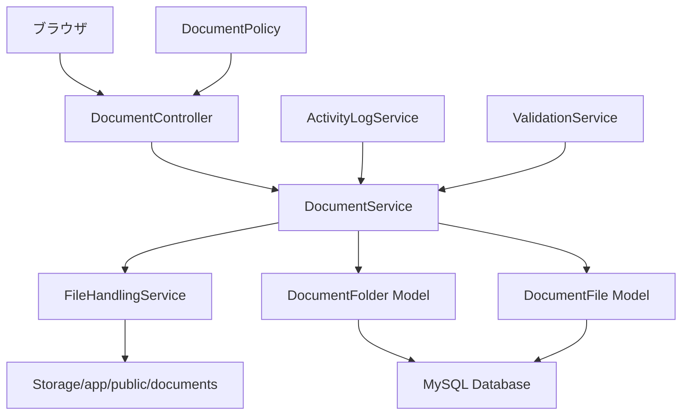

# 設計書

## 概要

施設ドキュメント管理システムは、既存の施設管理システムに統合される包括的なファイル管理機能です。このシステムは、階層的なフォルダ構造、複数の表示モード、高度なソート機能、セキュアなファイル操作を提供し、施設関連ドキュメントの効率的な管理を実現します。

## アーキテクチャ

### システム構成



### レイヤー構成

1. **プレゼンテーション層**
   - Blade テンプレート（ドキュメントタブUI）
   - JavaScript モジュール（フォルダナビゲーション、ファイル操作）
   - CSS スタイル（レスポンシブデザイン）

2. **コントローラー層**
   - DocumentController（メインコントローラー）
   - DocumentFolderController（フォルダ操作）
   - DocumentFileController（ファイル操作）

3. **サービス層**
   - DocumentService（ビジネスロジック）
   - FileHandlingService（ファイル処理）
   - ActivityLogService（操作ログ）

4. **データアクセス層**
   - DocumentFolder Model
   - DocumentFile Model
   - Facility Model（既存）

## コンポーネントと インターフェース

### データベース設計

#### document_folders テーブル
```sql
CREATE TABLE document_folders (
    id BIGINT UNSIGNED AUTO_INCREMENT PRIMARY KEY,
    facility_id BIGINT UNSIGNED NOT NULL,
    parent_id BIGINT UNSIGNED NULL,
    name VARCHAR(255) NOT NULL,
    path TEXT NOT NULL,
    created_by BIGINT UNSIGNED NOT NULL,
    created_at TIMESTAMP NULL DEFAULT NULL,
    updated_at TIMESTAMP NULL DEFAULT NULL,
    
    INDEX idx_facility_id (facility_id),
    INDEX idx_parent_id (parent_id),
    INDEX idx_path (path(191)),
    FOREIGN KEY (facility_id) REFERENCES facilities(id) ON DELETE CASCADE,
    FOREIGN KEY (parent_id) REFERENCES document_folders(id) ON DELETE CASCADE,
    FOREIGN KEY (created_by) REFERENCES users(id)
);
```

#### document_files テーブル
```sql
CREATE TABLE document_files (
    id BIGINT UNSIGNED AUTO_INCREMENT PRIMARY KEY,
    facility_id BIGINT UNSIGNED NOT NULL,
    folder_id BIGINT UNSIGNED NULL,
    original_name VARCHAR(255) NOT NULL,
    stored_name VARCHAR(255) NOT NULL,
    file_path TEXT NOT NULL,
    file_size BIGINT UNSIGNED NOT NULL,
    mime_type VARCHAR(100) NOT NULL,
    file_extension VARCHAR(10) NOT NULL,
    uploaded_by BIGINT UNSIGNED NOT NULL,
    created_at TIMESTAMP NULL DEFAULT NULL,
    updated_at TIMESTAMP NULL DEFAULT NULL,
    
    INDEX idx_facility_id (facility_id),
    INDEX idx_folder_id (folder_id),
    INDEX idx_file_extension (file_extension),
    INDEX idx_created_at (created_at),
    FOREIGN KEY (facility_id) REFERENCES facilities(id) ON DELETE CASCADE,
    FOREIGN KEY (folder_id) REFERENCES document_folders(id) ON DELETE CASCADE,
    FOREIGN KEY (uploaded_by) REFERENCES users(id)
);
```

### モデル設計

#### DocumentFolder Model
```php
class DocumentFolder extends Model
{
    protected $fillable = [
        'facility_id', 'parent_id', 'name', 'path', 'created_by'
    ];

    // リレーション
    public function facility(): BelongsTo;
    public function parent(): BelongsTo;
    public function children(): HasMany;
    public function files(): HasMany;
    public function creator(): BelongsTo;

    // メソッド
    public function getFullPath(): string;
    public function hasChildren(): bool;
    public function getFileCount(): int;
    public function getTotalSize(): int;
    public function canDelete(): bool;
}
```

#### DocumentFile Model
```php
class DocumentFile extends Model
{
    protected $fillable = [
        'facility_id', 'folder_id', 'original_name', 'stored_name',
        'file_path', 'file_size', 'mime_type', 'file_extension', 'uploaded_by'
    ];

    // リレーション
    public function facility(): BelongsTo;
    public function folder(): BelongsTo;
    public function uploader(): BelongsTo;

    // メソッド
    public function getFormattedSize(): string;
    public function getFileIcon(): string;
    public function getFileColor(): string;
    public function getDownloadUrl(): string;
    public function canPreview(): bool;
}
```

### サービス設計

#### DocumentService
```php
class DocumentService
{
    // フォルダ操作
    public function createFolder(Facility $facility, ?DocumentFolder $parent, string $name, User $user): DocumentFolder;
    public function renameFolder(DocumentFolder $folder, string $newName, User $user): DocumentFolder;
    public function deleteFolder(DocumentFolder $folder, User $user): bool;
    public function moveFolder(DocumentFolder $folder, ?DocumentFolder $newParent, User $user): DocumentFolder;

    // ファイル操作
    public function uploadFile(Facility $facility, ?DocumentFolder $folder, UploadedFile $file, User $user): DocumentFile;
    public function deleteFile(DocumentFile $file, User $user): bool;
    public function moveFile(DocumentFile $file, ?DocumentFolder $newFolder, User $user): DocumentFile;

    // 表示用データ生成
    public function getFolderContents(Facility $facility, ?DocumentFolder $folder, array $options = []): array;
    public function getBreadcrumbs(DocumentFolder $folder): array;
    public function getStorageStats(Facility $facility): array;
}
```

### コントローラー設計

#### DocumentController
```php
class DocumentController extends Controller
{
    // メイン表示
    public function index(Facility $facility): View;
    public function show(Facility $facility, ?DocumentFolder $folder = null): JsonResponse;

    // フォルダ操作
    public function createFolder(CreateFolderRequest $request, Facility $facility): JsonResponse;
    public function renameFolder(RenameFolderRequest $request, DocumentFolder $folder): JsonResponse;
    public function deleteFolder(DocumentFolder $folder): JsonResponse;

    // ファイル操作
    public function uploadFile(UploadFileRequest $request, Facility $facility): JsonResponse;
    public function downloadFile(DocumentFile $file): StreamedResponse;
    public function deleteFile(DocumentFile $file): JsonResponse;
    public function previewFile(DocumentFile $file): Response;
}
```

## データモデル

### フォルダ階層構造
```
施設A (facility_id: 1)
├── 契約書類 (id: 1, parent_id: null)
│   ├── 保守契約 (id: 2, parent_id: 1)
│   └── 清掃契約 (id: 3, parent_id: 1)
├── 図面 (id: 4, parent_id: null)
│   ├── 建築図面 (id: 5, parent_id: 4)
│   └── 設備図面 (id: 6, parent_id: 4)
└── 点検記録 (id: 7, parent_id: null)
```

### ファイル管理構造

#### テスト環境（SQLite + ローカルストレージ）
```
storage/app/public/documents/
├── facility_1/
│   ├── folder_1/
│   │   ├── contract_20241201_123456.pdf
│   │   └── maintenance_20241201_123457.pdf
│   ├── folder_4/
│   │   └── blueprint_20241201_123458.pdf
│   └── root/
│       └── general_document_20241201_123459.pdf
```

#### 開発・本番環境（MySQL + AWS S3）
```
S3 Bucket: facility-documents-{environment}
├── facility_1/
│   ├── folder_1/
│   │   ├── contract_20241201_123456.pdf
│   │   └── maintenance_20241201_123457.pdf
│   ├── folder_4/
│   │   └── blueprint_20241201_123458.pdf
│   └── root/
│       └── general_document_20241201_123459.pdf
```

## エラーハンドリング

### エラー分類と対応

#### バリデーションエラー
- **フォルダ名重複**: 同一階層での名前重複チェック
- **ファイルサイズ超過**: 設定可能な最大サイズ制限
- **ファイル形式不正**: サポート対象外の形式
- **権限不足**: ユーザーの操作権限チェック

#### システムエラー
- **ストレージ容量不足**: ディスク容量チェック
- **ファイル破損**: アップロード時の整合性チェック
- **データベース制約違反**: 外部キー制約等
- **ネットワークエラー**: アップロード中断時の処理

#### セキュリティエラー
- **不正アクセス**: 認証・認可チェック
- **パストラバーサル攻撃**: ファイルパス検証
- **悪意のあるファイル**: ファイル内容スキャン
- **セッション期限切れ**: 認証状態確認

### エラーハンドリング戦略

```php
// サービス層でのエラーハンドリング例
public function uploadFile(Facility $facility, ?DocumentFolder $folder, UploadedFile $file, User $user): DocumentFile
{
    try {
        // 権限チェック
        if (!$user->canEditFacility($facility->id)) {
            throw new UnauthorizedException('ファイルをアップロードする権限がありません。');
        }

        // ファイル検証
        $this->validateFile($file);

        // ストレージ容量チェック
        $this->checkStorageCapacity($facility, $file->getSize());

        // ファイル保存
        $result = $this->fileHandlingService->uploadFile($file, $this->getStoragePath($facility, $folder), 'document');

        // データベース保存
        $documentFile = DocumentFile::create([
            'facility_id' => $facility->id,
            'folder_id' => $folder?->id,
            'original_name' => $file->getClientOriginalName(),
            'stored_name' => $result['stored_filename'],
            'file_path' => $result['path'],
            'file_size' => $file->getSize(),
            'mime_type' => $file->getClientMimeType(),
            'file_extension' => $file->getClientOriginalExtension(),
            'uploaded_by' => $user->id,
        ]);

        // アクティビティログ
        $this->activityLogService->logDocumentUploaded($facility, $documentFile, $user);

        return $documentFile;

    } catch (ValidationException $e) {
        throw $e;
    } catch (UnauthorizedException $e) {
        throw $e;
    } catch (StorageException $e) {
        Log::error('Storage error during file upload', [
            'facility_id' => $facility->id,
            'user_id' => $user->id,
            'error' => $e->getMessage()
        ]);
        throw new DocumentServiceException('ストレージエラーが発生しました。');
    } catch (Exception $e) {
        Log::error('Unexpected error during file upload', [
            'facility_id' => $facility->id,
            'user_id' => $user->id,
            'error' => $e->getMessage()
        ]);
        throw new DocumentServiceException('ファイルのアップロードに失敗しました。');
    }
}
```

## テスト戦略

### テスト分類

#### 単体テスト (Unit Tests)
- **Model Tests**: DocumentFolder, DocumentFile モデルのメソッドテスト
- **Service Tests**: DocumentService の各メソッドテスト
- **Policy Tests**: DocumentPolicy の認可ロジックテスト
- **Validation Tests**: リクエストバリデーションテスト

#### 機能テスト (Feature Tests)
- **Controller Tests**: HTTP リクエスト・レスポンステスト
- **Integration Tests**: サービス間連携テスト
- **File Operation Tests**: ファイルアップロード・ダウンロードテスト
- **Permission Tests**: 権限制御テスト

#### ブラウザテスト (Browser Tests)
- **UI Interaction Tests**: フォルダ作成・削除操作テスト
- **File Upload Tests**: ドラッグ&ドロップアップロードテスト
- **Navigation Tests**: フォルダナビゲーションテスト
- **Responsive Tests**: レスポンシブデザインテスト

### テスト実装例

```php
// 機能テスト例
class DocumentManagementTest extends TestCase
{
    /** @test */
    public function user_can_create_folder_in_facility_documents()
    {
        $facility = Facility::factory()->create();
        $user = User::factory()->create();
        
        $this->actingAs($user);
        
        $response = $this->postJson(route('facilities.documents.folders.store', $facility), [
            'name' => '契約書類',
            'parent_id' => null,
        ]);
        
        $response->assertStatus(201);
        $response->assertJsonStructure([
            'success',
            'folder' => ['id', 'name', 'path', 'created_at']
        ]);
        
        $this->assertDatabaseHas('document_folders', [
            'facility_id' => $facility->id,
            'name' => '契約書類',
            'parent_id' => null,
        ]);
    }

    /** @test */
    public function user_can_upload_file_to_folder()
    {
        Storage::fake('public');
        
        $facility = Facility::factory()->create();
        $folder = DocumentFolder::factory()->create(['facility_id' => $facility->id]);
        $user = User::factory()->create();
        
        $this->actingAs($user);
        
        $file = UploadedFile::fake()->create('contract.pdf', 1024, 'application/pdf');
        
        $response = $this->postJson(route('facilities.documents.files.store', $facility), [
            'file' => $file,
            'folder_id' => $folder->id,
        ]);
        
        $response->assertStatus(201);
        
        $this->assertDatabaseHas('document_files', [
            'facility_id' => $facility->id,
            'folder_id' => $folder->id,
            'original_name' => 'contract.pdf',
        ]);
        
        Storage::disk('public')->assertExists('documents/facility_' . $facility->id . '/folder_' . $folder->id . '/' . $file->hashName());
    }
}
```

## セキュリティ考慮事項

### 認証・認可

#### ポリシーベース認可
```php
class DocumentPolicy
{
    public function viewAny(User $user, Facility $facility): bool
    {
        return $user->canViewFacility($facility->id);
    }

    public function create(User $user, Facility $facility): bool
    {
        return $user->canEditFacility($facility->id);
    }

    public function update(User $user, DocumentFolder $folder): bool
    {
        return $user->canEditFacility($folder->facility_id);
    }

    public function delete(User $user, DocumentFolder $folder): bool
    {
        return $user->canEditFacility($folder->facility_id) && $folder->canDelete();
    }
}
```

#### ファイルアクセス制御
- **直接アクセス防止**: storage/app/public 以外への保存
- **認証チェック**: ダウンロード時の権限確認
- **セッション検証**: CSRF トークン検証
- **ファイル検証**: MIMEタイプ・拡張子チェック

### データ保護

#### ファイル暗号化
- **保存時暗号化**: 機密ファイルの暗号化保存
- **転送時暗号化**: HTTPS 通信の強制
- **アクセスログ**: ファイルアクセス履歴の記録

#### バックアップ戦略
- **定期バックアップ**: ファイルとメタデータの同期バックアップ
- **バージョン管理**: ファイル更新履歴の保持
- **災害復旧**: バックアップからの復旧手順

## パフォーマンス最適化

### データベース最適化

#### インデックス戦略
```sql
-- 施設別フォルダ検索用
CREATE INDEX idx_folders_facility_parent ON document_folders(facility_id, parent_id);

-- ファイル検索用
CREATE INDEX idx_files_facility_folder ON document_files(facility_id, folder_id);

-- 作成日時ソート用
CREATE INDEX idx_files_created_at ON document_files(created_at DESC);

-- ファイルサイズ集計用
CREATE INDEX idx_files_size ON document_files(facility_id, file_size);
```

#### クエリ最適化
```php
// N+1問題の回避
public function getFolderContents(Facility $facility, ?DocumentFolder $folder): array
{
    $folders = DocumentFolder::with(['creator'])
        ->where('facility_id', $facility->id)
        ->where('parent_id', $folder?->id)
        ->orderBy('name')
        ->get();

    $files = DocumentFile::with(['uploader'])
        ->where('facility_id', $facility->id)
        ->where('folder_id', $folder?->id)
        ->orderBy('original_name')
        ->get();

    return compact('folders', 'files');
}
```

### フロントエンド最適化

#### 遅延読み込み
```javascript
// フォルダ内容の遅延読み込み
class DocumentManager {
    async loadFolderContents(folderId = null) {
        const response = await fetch(`/facilities/${this.facilityId}/documents/folders/${folderId || 'root'}`);
        const data = await response.json();
        
        this.renderFolderContents(data);
        this.updateBreadcrumbs(data.breadcrumbs);
    }

    // 仮想スクロール（大量ファイル対応）
    initVirtualScroll() {
        this.virtualScroll = new VirtualScroll({
            container: this.fileListContainer,
            itemHeight: 50,
            renderItem: this.renderFileItem.bind(this)
        });
    }
}
```

#### キャッシュ戦略
- **ブラウザキャッシュ**: 静的アセットの長期キャッシュ
- **API レスポンスキャッシュ**: フォルダ構造の短期キャッシュ
- **画像サムネイル**: 画像ファイルのサムネイル生成・キャッシュ
- **S3 CloudFront**: 本番環境でのファイル配信最適化

#### ストレージ設定
```php
// config/filesystems.php
'disks' => [
    'documents' => [
        'driver' => env('DOCUMENTS_STORAGE_DRIVER', 'local'),
        'root' => storage_path('app/public/documents'),
        'url' => env('APP_URL').'/storage/documents',
        'visibility' => 'public',
    ],
    
    'documents_s3' => [
        'driver' => 's3',
        'key' => env('AWS_ACCESS_KEY_ID'),
        'secret' => env('AWS_SECRET_ACCESS_KEY'),
        'region' => env('AWS_DEFAULT_REGION'),
        'bucket' => env('AWS_DOCUMENTS_BUCKET'),
        'url' => env('AWS_DOCUMENTS_URL'),
        'endpoint' => env('AWS_ENDPOINT'),
        'use_path_style_endpoint' => env('AWS_USE_PATH_STYLE_ENDPOINT', false),
    ],
],
```

## 統合設計

### 既存システムとの統合

#### タブ統合
```blade
{{-- resources/views/facilities/show.blade.php への追加 --}}
<li class="nav-item" role="presentation">
    <button class="nav-link" id="documents-tab" data-bs-toggle="tab" data-bs-target="#documents" type="button" role="tab" aria-controls="documents" aria-selected="false">
        <i class="fas fa-folder me-2"></i>ドキュメント
    </button>
</li>

{{-- タブコンテンツ --}}
<div class="tab-pane fade" id="documents" role="tabpanel" aria-labelledby="documents-tab">
    @include('facilities.documents.index', ['facility' => $facility])
</div>
```

#### 権限システム統合
```php
// 既存のUser モデルへのメソッド追加
public function canManageDocuments(int $facilityId): bool
{
    return $this->canEditFacility($facilityId);
}

public function canViewDocuments(int $facilityId): bool
{
    return $this->canViewFacility($facilityId);
}
```

#### アクティビティログ統合
```php
// ActivityLogService への追加
public function logDocumentUploaded(Facility $facility, DocumentFile $file, User $user): void
{
    $this->logActivity(
        $user->id,
        'document_uploaded',
        $facility->id,
        "ドキュメント「{$file->original_name}」をアップロードしました",
        ['file_id' => $file->id, 'file_size' => $file->file_size]
    );
}
```

### API 設計

#### RESTful エンドポイント
```php
// routes/web.php
Route::prefix('facilities/{facility}/documents')->group(function () {
    Route::get('/', [DocumentController::class, 'index'])->name('facilities.documents.index');
    Route::get('/folders/{folder?}', [DocumentController::class, 'show'])->name('facilities.documents.show');
    
    Route::post('/folders', [DocumentController::class, 'createFolder'])->name('facilities.documents.folders.store');
    Route::put('/folders/{folder}', [DocumentController::class, 'updateFolder'])->name('facilities.documents.folders.update');
    Route::delete('/folders/{folder}', [DocumentController::class, 'deleteFolder'])->name('facilities.documents.folders.destroy');
    
    Route::post('/files', [DocumentController::class, 'uploadFile'])->name('facilities.documents.files.store');
    Route::get('/files/{file}/download', [DocumentController::class, 'downloadFile'])->name('facilities.documents.files.download');
    Route::get('/files/{file}/preview', [DocumentController::class, 'previewFile'])->name('facilities.documents.files.preview');
    Route::delete('/files/{file}', [DocumentController::class, 'deleteFile'])->name('facilities.documents.files.destroy');
});
```

この設計により、セキュアで拡張性の高い、ユーザーフレンドリーなドキュメント管理システムを実現します。