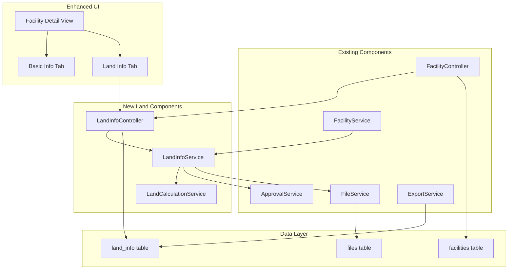

# Design Document

## Overview

施設詳細画面に土地情報管理機能を追加します。既存のfacilitiesテーブルを拡張し、土地情報専用のデータベーステーブルを新設します。フロントエンドはタブ形式のUIを採用し、所有形態に応じた動的な項目表示と自動計算機能を実装します。既存の承認フロー、権限制御、ファイル管理、出力機能との統合を行います。

## Architecture

### Component Integration



### Technology Integration

- **Backend Extension**: 既存Laravel 9.x アプリケーションに新機能追加
- **Database**: 既存MySQL 8.0 に新テーブル追加
- **Frontend**: 既存Blade Templates + Bootstrap 5 を拡張
- **File Storage**: 既存AWS S3 ファイル管理システムを活用
- **Authentication**: 既存Laravel Sanctum 認証システムを継承

## Components and Interfaces

### New Components

#### 1. Land Information Controller
```php
class LandInfoController extends Controller
{
    public function show(Facility $facility)
    public function edit(Facility $facility) 
    public function update(Request $request, Facility $facility)
    public function calculateFields(Request $request)
}
```

#### 2. Land Information Service
```php
class LandInfoService
{
    public function getLandInfo(Facility $facility): ?LandInfo
    public function createOrUpdateLandInfo(Facility $facility, array $data): LandInfo
    public function formatDisplayData(LandInfo $landInfo): array
    public function prepareForApproval(LandInfo $landInfo, array $changes): void
}
```

#### 3. Land Calculation Service
```php
class LandCalculationService
{
    public function calculateUnitPrice(float $purchasePrice, float $areaInTsubo): ?float
    public function calculateContractPeriod(string $startDate, string $endDate): string
    public function formatCurrency(float $amount): string
    public function formatArea(float $area, string $unit): string
    public function formatJapaneseDate(string $date): string
}
```

### Enhanced Components

#### 1. Facility Controller Enhancement
```php
// 既存のFacilityControllerに追加
public function show(Facility $facility)
{
    // 既存の基本情報に加えて土地情報も取得
    $landInfo = $this->landInfoService->getLandInfo($facility);
    return view('facilities.show', compact('facility', 'landInfo'));
}
```

#### 2. Export Service Enhancement
```php
// 既存のExportServiceに土地情報項目を追加
public function getAvailableFields(): array
{
    return array_merge(
        $this->getFacilityFields(),
        $this->getLandInfoFields() // 新規追加
    );
}
```

### API Endpoints

#### New Endpoints
```
GET /facilities/{id}/land-info
POST /facilities/{id}/land-info
PUT /facilities/{id}/land-info
POST /facilities/{id}/land-info/calculate
```

#### Enhanced Endpoints
```
GET /facilities/{id} (土地情報を含む)
GET /export/csv (土地情報項目を含む)
POST /export/pdf (土地情報を含む帳票)
```

## Data Models

### New Land Information Table

```sql
CREATE TABLE land_info (
    id BIGINT PRIMARY KEY AUTO_INCREMENT,
    facility_id BIGINT NOT NULL,
    
    -- 基本情報
    ownership_type ENUM('owned', 'leased', 'owned_rental') NOT NULL COMMENT '所有形態: 自社/賃借/自社（賃貸）',
    parking_spaces INT NULL COMMENT '敷地内駐車場台数',
    
    -- 面積情報
    site_area_sqm DECIMAL(10,2) NULL COMMENT '敷地面積(㎡)',
    site_area_tsubo DECIMAL(10,2) NULL COMMENT '敷地面積(坪数)',
    
    -- 金額情報（自社の場合）
    purchase_price DECIMAL(15,0) NULL COMMENT '購入金額',
    unit_price_per_tsubo DECIMAL(15,0) NULL COMMENT '坪単価（自動計算）',
    
    -- 賃借情報
    monthly_rent DECIMAL(15,0) NULL COMMENT '家賃',
    contract_start_date DATE NULL COMMENT '契約開始日',
    contract_end_date DATE NULL COMMENT '契約終了日',
    auto_renewal ENUM('yes', 'no') NULL COMMENT '自動更新の有無',
    contract_period_text VARCHAR(50) NULL COMMENT '契約年数（自動計算）',
    
    -- 管理会社情報
    management_company_name VARCHAR(30) NULL COMMENT '管理会社（会社名）',
    management_company_postal_code VARCHAR(8) NULL COMMENT '管理会社（郵便番号）',
    management_company_address VARCHAR(30) NULL COMMENT '管理会社（住所）',
    management_company_building VARCHAR(20) NULL COMMENT '管理会社（住所建物名）',
    management_company_phone VARCHAR(13) NULL COMMENT '管理会社（電話番号）',
    management_company_fax VARCHAR(13) NULL COMMENT '管理会社（FAX番号）',
    management_company_email VARCHAR(100) NULL COMMENT '管理会社（メールアドレス）',
    management_company_url VARCHAR(100) NULL COMMENT '管理会社（URL）',
    management_company_notes TEXT NULL COMMENT '管理会社（備考）',
    
    -- オーナー情報
    owner_name VARCHAR(30) NULL COMMENT 'オーナー（氏名・会社名）',
    owner_postal_code VARCHAR(8) NULL COMMENT 'オーナー（郵便番号）',
    owner_address VARCHAR(30) NULL COMMENT 'オーナー（住所）',
    owner_building VARCHAR(20) NULL COMMENT 'オーナー（住所建物名）',
    owner_phone VARCHAR(13) NULL COMMENT 'オーナー（電話番号）',
    owner_fax VARCHAR(13) NULL COMMENT 'オーナー（FAX番号）',
    owner_email VARCHAR(100) NULL COMMENT 'オーナー（メールアドレス）',
    owner_url VARCHAR(100) NULL COMMENT 'オーナー（URL）',
    owner_notes TEXT NULL COMMENT 'オーナー（備考欄）',
    
    -- その他
    notes TEXT NULL COMMENT '備考欄',
    
    -- システム項目
    status ENUM('draft', 'pending_approval', 'approved') DEFAULT 'approved',
    approved_at TIMESTAMP NULL,
    approved_by BIGINT NULL,
    created_by BIGINT NOT NULL,
    updated_by BIGINT NOT NULL,
    created_at TIMESTAMP DEFAULT CURRENT_TIMESTAMP,
    updated_at TIMESTAMP DEFAULT CURRENT_TIMESTAMP ON UPDATE CURRENT_TIMESTAMP,
    
    FOREIGN KEY (facility_id) REFERENCES facilities(id) ON DELETE CASCADE,
    FOREIGN KEY (approved_by) REFERENCES users(id),
    FOREIGN KEY (created_by) REFERENCES users(id),
    FOREIGN KEY (updated_by) REFERENCES users(id),
    
    UNIQUE KEY unique_facility_land (facility_id)
);
```

### Enhanced Files Table

既存のfilesテーブルにland_document_typeカラムを追加：

```sql
ALTER TABLE files ADD COLUMN land_document_type ENUM('lease_contract', 'property_register', 'other') NULL COMMENT '土地関連書類種別';
```

### Model Relationships

#### LandInfo Model
```php
class LandInfo extends Model
{
    protected $table = 'land_info';
    
    protected $fillable = [
        'facility_id', 'ownership_type', 'parking_spaces',
        'site_area_sqm', 'site_area_tsubo', 'purchase_price',
        'monthly_rent', 'contract_start_date', 'contract_end_date',
        'auto_renewal', 'management_company_name', // ... 他の項目
    ];
    
    protected $casts = [
        'contract_start_date' => 'date',
        'contract_end_date' => 'date',
        'site_area_sqm' => 'decimal:2',
        'site_area_tsubo' => 'decimal:2',
        'purchase_price' => 'integer',
        'monthly_rent' => 'integer',
        'approved_at' => 'datetime',
    ];
    
    // Relationships
    public function facility(): BelongsTo
    {
        return $this->belongsTo(Facility::class);
    }
    
    public function approver(): BelongsTo
    {
        return $this->belongsTo(User::class, 'approved_by');
    }
    
    public function creator(): BelongsTo
    {
        return $this->belongsTo(User::class, 'created_by');
    }
    
    public function updater(): BelongsTo
    {
        return $this->belongsTo(User::class, 'updated_by');
    }
    
    public function documents(): HasMany
    {
        return $this->hasMany(File::class, 'facility_id', 'facility_id')
                    ->whereNotNull('land_document_type');
    }
    
    // Accessors & Mutators
    public function getFormattedPurchasePriceAttribute(): string
    {
        return $this->purchase_price ? number_format($this->purchase_price) : '';
    }
    
    public function getFormattedMonthlyRentAttribute(): string
    {
        return $this->monthly_rent ? number_format($this->monthly_rent) : '';
    }
    
    public function getFormattedSiteAreaSqmAttribute(): string
    {
        return $this->site_area_sqm ? number_format($this->site_area_sqm, 2) . '㎡' : '';
    }
    
    public function getFormattedSiteAreaTsuboAttribute(): string
    {
        return $this->site_area_tsubo ? number_format($this->site_area_tsubo, 2) . '坪' : '';
    }
    
    public function getJapaneseContractStartDateAttribute(): string
    {
        return $this->contract_start_date ? 
            $this->contract_start_date->format('Y年n月j日') : '';
    }
    
    public function getJapaneseContractEndDateAttribute(): string
    {
        return $this->contract_end_date ? 
            $this->contract_end_date->format('Y年n月j日') : '';
    }
}
```

#### Enhanced Facility Model
```php
class Facility extends Model
{
    // 既存のリレーションに追加
    public function landInfo(): HasOne
    {
        return $this->hasOne(LandInfo::class);
    }
    
    public function landDocuments(): HasMany
    {
        return $this->hasMany(File::class)
                    ->whereNotNull('land_document_type');
    }
}
```

## User Interface Design

### Tab Navigation Structure

```html
<!-- facilities/show.blade.php -->
<div class="facility-detail-container">
    <div class="tab-navigation">
        <ul class="nav nav-tabs" id="facilityTabs">
            <li class="nav-item">
                <a class="nav-link active" id="basic-tab" data-bs-toggle="tab" href="#basic-info">基本</a>
            </li>
            <li class="nav-item">
                <a class="nav-link" id="land-tab" data-bs-toggle="tab" href="#land-info">土地</a>
            </li>
        </ul>
    </div>
    
    <div class="tab-content" id="facilityTabContent">
        <div class="tab-pane fade show active" id="basic-info">
            @include('facilities.partials.basic-info', ['facility' => $facility])
        </div>
        <div class="tab-pane fade" id="land-info">
            @include('facilities.partials.land-info', ['facility' => $facility, 'landInfo' => $landInfo])
        </div>
    </div>
</div>
```

### Land Information Form Layout

```html
<!-- facilities/partials/land-info.blade.php -->
<div class="land-info-form">
    <!-- 基本情報セクション -->
    <div class="form-section">
        <h4>基本情報</h4>
        <div class="row">
            <div class="col-md-4">
                <label>所有</label>
                <select name="ownership_type" class="form-select" id="ownershipType">
                    <option value="">選択してください</option>
                    <option value="owned">自社</option>
                    <option value="leased">賃借</option>
                    <option value="owned_rental">自社（賃貸）</option>
                </select>
            </div>
            <div class="col-md-4">
                <label>敷地内駐車場台数</label>
                <input type="number" name="parking_spaces" class="form-control">
            </div>
        </div>
    </div>
    
    <!-- 面積情報セクション -->
    <div class="form-section">
        <h4>面積情報</h4>
        <div class="row">
            <div class="col-md-6">
                <label>敷地面積(㎡)</label>
                <input type="number" step="0.01" name="site_area_sqm" class="form-control" id="siteAreaSqm">
                <small class="form-text text-muted">例: 290 → 表示: 290.00㎡</small>
            </div>
            <div class="col-md-6">
                <label>敷地面積(坪数)</label>
                <input type="number" step="0.01" name="site_area_tsubo" class="form-control" id="siteAreaTsubo">
                <small class="form-text text-muted">例: 89.05 → 表示: 89.05坪</small>
            </div>
        </div>
    </div>
    
    <!-- 所有形態別セクション -->
    <div id="ownedSection" class="form-section conditional-section">
        <h4>自社物件情報</h4>
        <div class="row">
            <div class="col-md-6">
                <label>購入金額</label>
                <input type="number" name="purchase_price" class="form-control currency-input" id="purchasePrice">
            </div>
            <div class="col-md-6">
                <label>坪単価（自動計算）</label>
                <input type="text" id="unitPrice" class="form-control" readonly>
            </div>
        </div>
    </div>
    
    <div id="leasedSection" class="form-section conditional-section">
        <h4>賃借物件情報</h4>
        <div class="row">
            <div class="col-md-4">
                <label>家賃</label>
                <input type="number" name="monthly_rent" class="form-control currency-input">
            </div>
            <div class="col-md-4">
                <label>契約開始日</label>
                <input type="date" name="contract_start_date" class="form-control" id="contractStartDate">
            </div>
            <div class="col-md-4">
                <label>契約終了日</label>
                <input type="date" name="contract_end_date" class="form-control" id="contractEndDate">
            </div>
        </div>
        <div class="row">
            <div class="col-md-4">
                <label>自動更新の有無</label>
                <select name="auto_renewal" class="form-select">
                    <option value="">選択してください</option>
                    <option value="yes">あり</option>
                    <option value="no">なし</option>
                </select>
            </div>
            <div class="col-md-4">
                <label>契約年数（自動計算）</label>
                <input type="text" id="contractPeriod" class="form-control" readonly>
            </div>
        </div>
    </div>
    
    <!-- 管理会社情報セクション -->
    <div id="managementSection" class="form-section conditional-section">
        <h4>管理会社情報</h4>
        <!-- 管理会社の各項目 -->
    </div>
    
    <!-- オーナー情報セクション -->
    <div id="ownerSection" class="form-section conditional-section">
        <h4>オーナー情報</h4>
        <!-- オーナーの各項目 -->
    </div>
    
    <!-- ファイルアップロードセクション -->
    <div class="form-section">
        <h4>関連書類</h4>
        <div class="file-upload-area">
            <label>賃貸借契約書・覚書</label>
            <input type="file" name="lease_contracts[]" multiple accept=".pdf" class="form-control">
        </div>
        <div class="file-upload-area">
            <label>謄本</label>
            <input type="file" name="property_register" accept=".pdf" class="form-control">
        </div>
    </div>
    
    <!-- 備考セクション -->
    <div class="form-section">
        <h4>備考</h4>
        <textarea name="notes" class="form-control" rows="5" maxlength="2000"></textarea>
    </div>
</div>
```

### JavaScript Functionality

```javascript
// resources/js/land-info.js
class LandInfoManager {
    constructor() {
        this.initializeEventListeners();
        this.updateConditionalSections();
    }
    
    initializeEventListeners() {
        // 所有形態変更時の表示制御
        document.getElementById('ownershipType').addEventListener('change', () => {
            this.updateConditionalSections();
        });
        
        // 自動計算機能
        document.getElementById('purchasePrice').addEventListener('input', () => {
            this.calculateUnitPrice();
        });
        
        document.getElementById('siteAreaTsubo').addEventListener('input', () => {
            this.calculateUnitPrice();
        });
        
        document.getElementById('contractStartDate').addEventListener('change', () => {
            this.calculateContractPeriod();
        });
        
        document.getElementById('contractEndDate').addEventListener('change', () => {
            this.calculateContractPeriod();
        });
        
        // 通貨フォーマット
        document.querySelectorAll('.currency-input').forEach(input => {
            input.addEventListener('blur', (e) => {
                this.formatCurrency(e.target);
            });
        });
    }
    
    updateConditionalSections() {
        const ownershipType = document.getElementById('ownershipType').value;
        
        // セクションの表示/非表示制御
        document.getElementById('ownedSection').style.display = 
            ownershipType === 'owned' ? 'block' : 'none';
            
        document.getElementById('leasedSection').style.display = 
            ['leased', 'owned_rental'].includes(ownershipType) ? 'block' : 'none';
            
        document.getElementById('managementSection').style.display = 
            ownershipType === 'leased' ? 'block' : 'none';
            
        document.getElementById('ownerSection').style.display = 
            ownershipType === 'leased' ? 'block' : 'none';
    }
    
    calculateUnitPrice() {
        const purchasePrice = parseFloat(document.getElementById('purchasePrice').value) || 0;
        const siteAreaTsubo = parseFloat(document.getElementById('siteAreaTsubo').value) || 0;
        
        if (purchasePrice > 0 && siteAreaTsubo > 0) {
            const unitPrice = Math.round(purchasePrice / siteAreaTsubo);
            document.getElementById('unitPrice').value = unitPrice.toLocaleString();
        } else {
            document.getElementById('unitPrice').value = '';
        }
    }
    
    calculateContractPeriod() {
        const startDate = new Date(document.getElementById('contractStartDate').value);
        const endDate = new Date(document.getElementById('contractEndDate').value);
        
        if (startDate && endDate && endDate > startDate) {
            const years = endDate.getFullYear() - startDate.getFullYear();
            const months = endDate.getMonth() - startDate.getMonth();
            
            let totalMonths = years * 12 + months;
            const displayYears = Math.floor(totalMonths / 12);
            const displayMonths = totalMonths % 12;
            
            let periodText = '';
            if (displayYears > 0) periodText += `${displayYears}年`;
            if (displayMonths > 0) periodText += `${displayMonths}ヶ月`;
            
            document.getElementById('contractPeriod').value = periodText || '0ヶ月';
        } else {
            document.getElementById('contractPeriod').value = '';
        }
    }
    
    formatCurrency(input) {
        const value = parseInt(input.value.replace(/,/g, '')) || 0;
        if (value > 0) {
            input.value = value.toLocaleString();
        }
    }
}

// 初期化
document.addEventListener('DOMContentLoaded', () => {
    new LandInfoManager();
});
```

## Integration with Existing Systems

### Approval Flow Integration

土地情報の変更は既存の承認フローシステムと統合：

```php
class LandInfoService
{
    public function updateLandInfo(Facility $facility, array $data, User $user): LandInfo
    {
        $landInfo = $facility->landInfo ?? new LandInfo(['facility_id' => $facility->id]);
        
        // 承認機能がONの場合
        if ($this->approvalService->isApprovalEnabled()) {
            $landInfo->fill($data);
            $landInfo->status = 'pending_approval';
            $landInfo->updated_by = $user->id;
            $landInfo->save();
            
            // 承認者に通知
            $this->approvalService->notifyApprovers($landInfo, 'land_info_update');
            
        } else {
            // 承認機能がOFFの場合は即座に反映
            $landInfo->fill($data);
            $landInfo->status = 'approved';
            $landInfo->approved_at = now();
            $landInfo->updated_by = $user->id;
            $landInfo->save();
        }
        
        return $landInfo;
    }
}
```

### Export System Integration

CSV/PDF出力システムに土地情報項目を追加：

```php
class ExportService
{
    public function getLandInfoFields(): array
    {
        return [
            'land_ownership_type' => '所有形態',
            'land_parking_spaces' => '敷地内駐車場台数',
            'land_site_area_sqm' => '敷地面積(㎡)',
            'land_site_area_tsubo' => '敷地面積(坪数)',
            'land_purchase_price' => '購入金額',
            'land_unit_price_per_tsubo' => '坪単価',
            'land_monthly_rent' => '家賃',
            'land_contract_start_date' => '契約開始日',
            'land_contract_end_date' => '契約終了日',
            'land_auto_renewal' => '自動更新の有無',
            'land_management_company_name' => '管理会社名',
            'land_owner_name' => 'オーナー名',
            'land_notes' => '土地備考',
        ];
    }
    
    public function exportFacilityWithLandInfo(Collection $facilities, array $selectedFields): string
    {
        $csvData = [];
        
        foreach ($facilities as $facility) {
            $row = [];
            
            foreach ($selectedFields as $field) {
                if (str_starts_with($field, 'land_')) {
                    $row[$field] = $this->getLandInfoFieldValue($facility->landInfo, $field);
                } else {
                    $row[$field] = $this->getFacilityFieldValue($facility, $field);
                }
            }
            
            $csvData[] = $row;
        }
        
        return $this->generateCsv($csvData);
    }
}
```

### File Management Integration

土地関連書類は既存のファイル管理システムを拡張：

```php
class FileService
{
    public function uploadLandDocument(Facility $facility, UploadedFile $file, string $documentType): File
    {
        $path = $this->storageService->store($file, "facilities/{$facility->id}/land");
        
        return File::create([
            'facility_id' => $facility->id,
            'original_name' => $file->getClientOriginalName(),
            'file_path' => $path,
            'file_size' => $file->getSize(),
            'mime_type' => $file->getMimeType(),
            'file_type' => 'land_document',
            'land_document_type' => $documentType,
            'uploaded_by' => auth()->id(),
        ]);
    }
}
```

## Error Handling

### Validation Rules

```php
class LandInfoRequest extends FormRequest
{
    public function rules(): array
    {
        return [
            'ownership_type' => 'required|in:owned,leased,owned_rental',
            'parking_spaces' => 'nullable|integer|min:0|max:9999999999',
            'site_area_sqm' => 'nullable|numeric|min:0|max:99999999.99',
            'site_area_tsubo' => 'nullable|numeric|min:0|max:99999999.99',
            'purchase_price' => 'nullable|integer|min:0|max:999999999999999',
            'monthly_rent' => 'nullable|integer|min:0|max:999999999999999',
            'contract_start_date' => 'nullable|date',
            'contract_end_date' => 'nullable|date|after:contract_start_date',
            'auto_renewal' => 'nullable|in:yes,no',
            
            // 管理会社情報
            'management_company_name' => 'nullable|string|max:30',
            'management_company_postal_code' => 'nullable|regex:/^\d{3}-\d{4}$/',
            'management_company_phone' => 'nullable|regex:/^\d{2,4}-\d{2,4}-\d{4}$/',
            'management_company_email' => 'nullable|email|max:100',
            'management_company_url' => 'nullable|url|max:100',
            
            // オーナー情報
            'owner_name' => 'nullable|string|max:30',
            'owner_postal_code' => 'nullable|regex:/^\d{3}-\d{4}$/',
            'owner_phone' => 'nullable|regex:/^\d{2,4}-\d{2,4}-\d{4}$/',
            'owner_email' => 'nullable|email|max:100',
            'owner_url' => 'nullable|url|max:100',
            
            'notes' => 'nullable|string|max:2000',
            
            // ファイルアップロード
            'lease_contracts.*' => 'nullable|file|mimes:pdf|max:10240',
            'property_register' => 'nullable|file|mimes:pdf|max:10240',
        ];
    }
}
```

### Error Response Handling

```php
class LandInfoController extends Controller
{
    public function update(LandInfoRequest $request, Facility $facility)
    {
        try {
            $landInfo = $this->landInfoService->updateLandInfo(
                $facility, 
                $request->validated(), 
                auth()->user()
            );
            
            return response()->json([
                'success' => true,
                'message' => '土地情報を更新しました。',
                'data' => $landInfo
            ]);
            
        } catch (ValidationException $e) {
            return response()->json([
                'success' => false,
                'message' => '入力内容に誤りがあります。',
                'errors' => $e->errors()
            ], 422);
            
        } catch (Exception $e) {
            Log::error('Land info update failed', [
                'facility_id' => $facility->id,
                'user_id' => auth()->id(),
                'error' => $e->getMessage()
            ]);
            
            return response()->json([
                'success' => false,
                'message' => 'システムエラーが発生しました。'
            ], 500);
        }
    }
}
```

## Testing Strategy

### Unit Testing

```php
class LandCalculationServiceTest extends TestCase
{
    public function test_calculate_unit_price()
    {
        $service = new LandCalculationService();
        
        $unitPrice = $service->calculateUnitPrice(10000000, 100.0);
        
        $this->assertEquals(100000, $unitPrice);
    }
    
    public function test_calculate_contract_period()
    {
        $service = new LandCalculationService();
        
        $period = $service->calculateContractPeriod('2020-01-01', '2025-06-01');
        
        $this->assertEquals('5年5ヶ月', $period);
    }
}
```

### Feature Testing

```php
class LandInfoManagementTest extends TestCase
{
    public function test_editor_can_create_land_info()
    {
        $user = User::factory()->create(['role' => 'editor']);
        $facility = Facility::factory()->create();
        
        $response = $this->actingAs($user)
            ->post("/facilities/{$facility->id}/land-info", [
                'ownership_type' => 'owned',
                'site_area_sqm' => 290.00,
                'purchase_price' => 10000000,
            ]);
            
        $response->assertStatus(200);
        $this->assertDatabaseHas('land_info', [
            'facility_id' => $facility->id,
            'ownership_type' => 'owned',
        ]);
    }
    
    public function test_land_info_requires_approval_when_enabled()
    {
        // 承認機能ON時のテスト
        SystemSetting::create(['key' => 'approval_enabled', 'value' => 'true']);
        
        $user = User::factory()->create(['role' => 'editor']);
        $facility = Facility::factory()->create();
        
        $response = $this->actingAs($user)
            ->post("/facilities/{$facility->id}/land-info", [
                'ownership_type' => 'leased',
                'monthly_rent' => 500000,
            ]);
            
        $this->assertDatabaseHas('land_info', [
            'facility_id' => $facility->id,
            'status' => 'pending_approval',
        ]);
    }
}
```

### Browser Testing

```php
class LandInfoBrowserTest extends DuskTestCase
{
    public function test_ownership_type_controls_form_sections()
    {
        $this->browse(function (Browser $browser) {
            $browser->loginAs(User::factory()->create(['role' => 'editor']))
                    ->visit('/facilities/1')
                    ->click('#land-tab')
                    ->select('ownership_type', 'owned')
                    ->assertVisible('#ownedSection')
                    ->assertNotVisible('#leasedSection')
                    ->select('ownership_type', 'leased')
                    ->assertNotVisible('#ownedSection')
                    ->assertVisible('#leasedSection');
        });
    }
    
    public function test_automatic_calculations_work()
    {
        $this->browse(function (Browser $browser) {
            $browser->loginAs(User::factory()->create(['role' => 'editor']))
                    ->visit('/facilities/1')
                    ->click('#land-tab')
                    ->select('ownership_type', 'owned')
                    ->type('purchase_price', '10000000')
                    ->type('site_area_tsubo', '100')
                    ->waitFor('#unitPrice')
                    ->assertInputValue('unitPrice', '100,000');
        });
    }
}
```

## Performance Considerations

### Database Optimization

```sql
-- インデックス追加
CREATE INDEX idx_land_info_facility_id ON land_info(facility_id);
CREATE INDEX idx_land_info_status ON land_info(status);
CREATE INDEX idx_land_info_ownership_type ON land_info(ownership_type);
```

### Caching Strategy

```php
class LandInfoService
{
    public function getLandInfoWithCache(Facility $facility): ?LandInfo
    {
        return Cache::remember(
            "land_info.facility.{$facility->id}",
            3600, // 1時間
            fn() => $facility->landInfo
        );
    }
    
    public function clearLandInfoCache(Facility $facility): void
    {
        Cache::forget("land_info.facility.{$facility->id}");
    }
}
```

### Lazy Loading

```php
class FacilityController
{
    public function show(Facility $facility)
    {
        // 必要な時のみ土地情報を読み込み
        $facility->load(['landInfo', 'landDocuments']);
        
        return view('facilities.show', compact('facility'));
    }
}
```

## Security Considerations

### Authorization

```php
class LandInfoPolicy
{
    public function view(User $user, LandInfo $landInfo): bool
    {
        return $user->canViewFacility($landInfo->facility);
    }
    
    public function update(User $user, LandInfo $landInfo): bool
    {
        return $user->canEditFacility($landInfo->facility);
    }
    
    public function approve(User $user, LandInfo $landInfo): bool
    {
        return $user->role === 'approver' && 
               $user->canViewFacility($landInfo->facility);
    }
}
```

### Input Sanitization

```php
class LandInfoService
{
    public function sanitizeInput(array $data): array
    {
        // 全角数字を半角に変換
        $numericFields = ['parking_spaces', 'purchase_price', 'monthly_rent'];
        
        foreach ($numericFields as $field) {
            if (isset($data[$field])) {
                $data[$field] = mb_convert_kana($data[$field], 'n');
            }
        }
        
        // HTMLタグの除去
        $textFields = ['notes', 'management_company_notes', 'owner_notes'];
        
        foreach ($textFields as $field) {
            if (isset($data[$field])) {
                $data[$field] = strip_tags($data[$field]);
            }
        }
        
        return $data;
    }
}
```