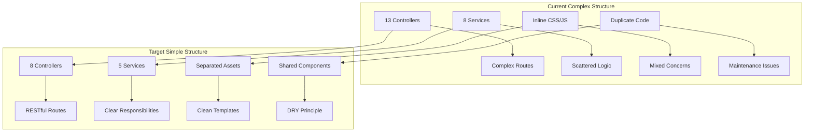

# Design Document

## Overview

Shise-Cal（施設カルテシステム）のプロジェクト構造をシンプル化するためのリファクタリング設計です。現在の複雑化した構造を整理し、保守性と可読性を向上させます。コントローラーの統合、サービスクラスの整理、ルート構造の簡素化、CSS/JavaScriptの分離を通じて、より管理しやすいコードベースを構築します。

## Architecture

### Current State Analysis



### Refactoring Strategy

#### Phase 1: Controller Consolidation
- **Merge Related Controllers**: 機能的に関連するコントローラーを統合
- **Maintain API Compatibility**: 既存のルートとの互換性を保持
- **Preserve Functionality**: 全ての既存機能を維持

#### Phase 2: Service Layer Optimization
- **Consolidate Business Logic**: 関連するビジネスロジックを統合
- **Clear Separation of Concerns**: 各サービスの責任範囲を明確化
- **Reduce Dependencies**: サービス間の依存関係を最小化

#### Phase 3: Asset Separation
- **Extract Inline Styles**: BladeテンプレートからCSSを分離
- **Modularize JavaScript**: 機能別にJavaScriptを整理
- **Create Shared Components**: 共通コンポーネントを作成

## Components and Interfaces

### Controller Consolidation Plan

#### Before (13 Controllers)
```
AuthController
FacilityController
LandInfoController
CommentController
FacilityCommentController
PdfExportController
CsvExportController
NotificationController
MyPageController
MaintenanceController
AnnualConfirmationController
ActivityLogController
Controller (Base)
```

#### After (8 Controllers)
```
AuthController (unchanged)
FacilityController (merged with LandInfoController)
CommentController (merged with FacilityCommentController)
ExportController (merged PdfExportController + CsvExportController)
NotificationController (unchanged)
MyPageController (unchanged)
MaintenanceController (unchanged)
AnnualConfirmationController (unchanged)
Controller (Base)
```

### Service Layer Restructuring

#### Before (8 Services)
```
ActivityLogService
FileService
LandInfoService
LandCalculationService
NotificationService
PerformanceMonitoringService
SecurePdfService
BatchPdfService
```

#### After (5 Services)
```
ActivityLogService (unchanged)
FacilityService (merged LandInfoService + LandCalculationService)
NotificationService (unchanged)
ExportService (merged SecurePdfService + BatchPdfService + FileService)
PerformanceMonitoringService (unchanged)
```

### Asset Organization Structure

#### CSS Architecture
```
resources/css/
├── app.css                 # Main application styles
├── shared/
│   ├── variables.css       # CSS custom properties
│   ├── base.css           # Base styles and resets
│   ├── layout.css         # Layout and grid systems
│   ├── components.css     # Reusable components
│   └── utilities.css      # Utility classes
├── pages/
│   ├── facilities.css     # Facility-related pages
│   ├── notifications.css  # Notification pages
│   ├── export.css         # Export functionality
│   ├── comments.css       # Comment system
│   ├── maintenance.css    # Maintenance pages
│   └── admin.css          # Admin interface
└── vendor/
    └── overrides.css      # Bootstrap overrides
```

#### JavaScript Architecture
```
resources/js/
├── app.js                 # Main application entry
├── shared/
│   ├── utils.js          # Common utility functions
│   ├── api.js            # API communication helpers
│   ├── validation.js     # Form validation helpers
│   └── components.js     # Reusable UI components
├── modules/
│   ├── facilities.js     # Facility management
│   ├── notifications.js  # Notification handling
│   ├── export.js         # Export functionality
│   ├── comments.js       # Comment system
│   ├── maintenance.js    # Maintenance features
│   └── admin.js          # Admin functionality
└── vendor/
    └── bootstrap-init.js  # Bootstrap initialization
```

## Data Models

### Controller Method Mapping

#### FacilityController (Enhanced)
```php
class FacilityController extends Controller
{
    // Existing facility methods
    public function index()
    public function show($id)
    public function create()
    public function store(Request $request)
    public function edit($id)
    public function update(Request $request, $id)
    public function destroy($id)
    
    // Basic info methods (existing)
    public function basicInfo($id)
    public function editBasicInfo($id)
    public function updateBasicInfo(Request $request, $id)
    
    // Land info methods (from LandInfoController)
    public function showLandInfo($id)
    public function editLandInfo($id)
    public function updateLandInfo(Request $request, $id)
    public function calculateLandFields(Request $request, $id)
    public function approveLandInfo(Request $request, $id)
    public function rejectLandInfo(Request $request, $id)
    
    // Document management (from LandInfoController)
    public function uploadDocuments(Request $request, $id)
    public function getDocuments($id)
    public function downloadDocument($id, $fileId)
    public function deleteDocument($id, $fileId)
}
```

#### ExportController (New)
```php
class ExportController extends Controller
{
    // PDF export methods (from PdfExportController)
    public function pdfIndex()
    public function generateSinglePdf($facilityId)
    public function generateSecurePdf($facilityId)
    public function generateBatchPdf(Request $request)
    public function getBatchProgress($batchId)
    
    // CSV export methods (from CsvExportController)
    public function csvIndex()
    public function getFieldPreview(Request $request)
    public function generateCsv(Request $request)
    
    // Favorites methods (from CsvExportController)
    public function getFavorites()
    public function saveFavorite(Request $request)
    public function loadFavorite($id)
    public function updateFavorite(Request $request, $id)
    public function deleteFavorite($id)
}
```

#### CommentController (Enhanced)
```php
class CommentController extends Controller
{
    // Existing comment methods
    public function index()
    public function store(Request $request)
    public function show($id)
    public function update(Request $request, $id)
    public function destroy($id)
    
    // Status management methods
    public function myComments()
    public function assignedComments()
    public function statusDashboard()
    public function updateStatus(Request $request, $id)
    public function bulkUpdateStatus(Request $request)
}
```

### Service Class Restructuring

#### FacilityService (New)
```php
class FacilityService
{
    // Basic facility operations
    public function createFacility(array $data)
    public function updateFacility($id, array $data)
    public function deleteFacility($id)
    public function getFacilityWithPermissions($id, User $user)
    
    // Land info operations (from LandInfoService)
    public function createLandInfo($facilityId, array $data)
    public function updateLandInfo($facilityId, array $data)
    public function approveLandInfo($facilityId, User $approver)
    public function rejectLandInfo($facilityId, User $approver, string $reason)
    
    // Calculation operations (from LandCalculationService)
    public function calculateUnitPrice(float $purchasePrice, float $area)
    public function calculateContractYears(string $startDate, string $endDate)
    public function formatCurrency(float $amount)
    public function formatArea(float $area, string $unit)
}
```

#### ExportService (New)
```php
class ExportService
{
    // PDF generation (from SecurePdfService + BatchPdfService)
    public function generateFacilityPdf($facilityId, array $options = [])
    public function generateSecurePdf($facilityId, array $options = [])
    public function generateBatchPdf(array $facilityIds, array $options = [])
    public function getBatchProgress($batchId)
    
    // CSV generation (from CsvExportController logic)
    public function generateCsv(array $facilityIds, array $fields)
    public function getAvailableFields()
    public function previewFieldData(array $facilityIds, array $fields)
    
    // File management (from FileService)
    public function uploadFile($file, $facilityId, string $type)
    public function downloadFile($fileId)
    public function deleteFile($fileId)
    public function getFilesByFacility($facilityId)
}
```

## Error Handling

### Consolidated Error Handling Strategy

#### Controller Error Handling
```php
// Shared error handling trait
trait HandlesControllerErrors
{
    protected function handleException(\Exception $e, string $context = '')
    {
        Log::error("Controller Error [{$context}]: " . $e->getMessage(), [
            'exception' => $e,
            'user_id' => auth()->id(),
            'request_url' => request()->url(),
        ]);
        
        if (request()->expectsJson()) {
            return response()->json([
                'success' => false,
                'message' => 'エラーが発生しました。',
                'error_code' => $this->getErrorCode($e)
            ], 500);
        }
        
        return back()->with('error', 'エラーが発生しました。しばらく時間をおいて再度お試しください。');
    }
    
    protected function getErrorCode(\Exception $e): string
    {
        return match(get_class($e)) {
            ValidationException::class => 'VALIDATION_ERROR',
            AuthorizationException::class => 'AUTHORIZATION_ERROR',
            ModelNotFoundException::class => 'NOT_FOUND',
            default => 'GENERAL_ERROR'
        };
    }
}
```

#### Service Error Handling
```php
// Shared service exception classes
class FacilityServiceException extends Exception {}
class ExportServiceException extends Exception {}
class ValidationServiceException extends Exception {}

// Service error handling trait
trait HandlesServiceErrors
{
    protected function logError(string $message, array $context = [])
    {
        Log::error($message, array_merge($context, [
            'service' => static::class,
            'user_id' => auth()->id() ?? null,
        ]));
    }
    
    protected function throwServiceException(string $message, int $code = 0)
    {
        $exceptionClass = $this->getServiceExceptionClass();
        throw new $exceptionClass($message, $code);
    }
    
    abstract protected function getServiceExceptionClass(): string;
}
```

## Testing Strategy

### Consolidated Test Structure

#### Controller Tests
```
tests/Feature/Controllers/
├── FacilityControllerTest.php      # Combined facility + land info tests
├── ExportControllerTest.php        # Combined PDF + CSV export tests
├── CommentControllerTest.php       # Combined comment tests
├── NotificationControllerTest.php  # Unchanged
├── MyPageControllerTest.php        # Unchanged
├── MaintenanceControllerTest.php   # Unchanged
└── AnnualConfirmationControllerTest.php # Unchanged
```

#### Service Tests
```
tests/Unit/Services/
├── FacilityServiceTest.php         # Combined facility + land calculation tests
├── ExportServiceTest.php           # Combined export service tests
├── NotificationServiceTest.php     # Unchanged
├── ActivityLogServiceTest.php      # Unchanged
└── PerformanceMonitoringServiceTest.php # Unchanged
```

#### Asset Tests
```
tests/Frontend/
├── CssCompilationTest.php          # CSS build verification
├── JavaScriptModuleTest.php        # JS module loading tests
└── AssetIntegrationTest.php        # End-to-end asset tests
```

### Test Data Consolidation

#### Shared Test Traits
```php
trait CreatesTestFacilities
{
    protected function createFacilityWithLandInfo(array $facilityData = [], array $landData = [])
    {
        $facility = Facility::factory()->create($facilityData);
        $landInfo = LandInfo::factory()->for($facility)->create($landData);
        
        return [$facility, $landInfo];
    }
}

trait CreatesTestUsers
{
    protected function createUserWithRole(string $role, array $attributes = [])
    {
        return User::factory()->create(array_merge(['role' => $role], $attributes));
    }
}
```

## Implementation Plan

### Phase 1: Controller Consolidation (Week 1)
1. **Merge LandInfoController into FacilityController**
   - Move all land info methods
   - Update route definitions
   - Maintain backward compatibility
   
2. **Merge Comment Controllers**
   - Consolidate FacilityCommentController into CommentController
   - Update related views and routes
   
3. **Create ExportController**
   - Merge PdfExportController and CsvExportController
   - Reorganize export-related routes

### Phase 2: Service Layer Optimization (Week 2)
1. **Create FacilityService**
   - Merge LandInfoService and LandCalculationService
   - Refactor business logic
   - Update controller dependencies
   
2. **Create ExportService**
   - Merge PDF and file services
   - Consolidate export logic
   - Update controller dependencies

### Phase 3: Asset Separation (Week 3)
1. **Extract CSS from Blade Templates**
   - Create feature-specific CSS files
   - Update Vite configuration
   - Remove inline styles from templates
   
2. **Extract JavaScript from Blade Templates**
   - Create modular JavaScript files
   - Implement ES6 modules
   - Remove inline scripts from templates

### Phase 4: Route Simplification (Week 4)
1. **Reorganize Route Structure**
   - Implement RESTful conventions
   - Group related routes
   - Maintain URL compatibility where possible
   
2. **Update Documentation**
   - Update API documentation
   - Create migration guide
   - Update deployment scripts

### Phase 5: Testing and Validation (Week 5)
1. **Update Test Suite**
   - Refactor existing tests
   - Add integration tests
   - Verify functionality preservation
   
2. **Performance Testing**
   - Benchmark before/after performance
   - Optimize asset loading
   - Validate build processes

## Migration Strategy

### Backward Compatibility
- **Route Aliases**: 古いルートを新しいルートにリダイレクト
- **Method Deprecation**: 段階的な廃止予定メソッドの警告
- **Configuration Migration**: 設定ファイルの自動移行スクリプト

### Rollback Plan
- **Git Branching**: 各フェーズごとのブランチ作成
- **Database Backups**: 変更前のデータベーススナップショット
- **Asset Versioning**: CSS/JSファイルのバージョン管理

### Monitoring and Validation
- **Error Tracking**: リファクタリング後のエラー監視
- **Performance Metrics**: レスポンス時間とメモリ使用量の追跡
- **User Feedback**: 機能の動作確認とユーザビリティテスト