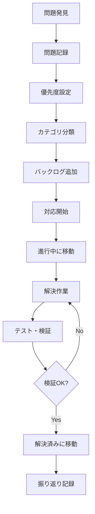

# 問題管理ワークフロー

問題の発見から解決までの標準的なワークフローを定義します。

## 基本ワークフロー

## 各段階の詳細

### 1. 問題発見
**トリガー**:
- テスト実行での失敗
- コードレビューでの指摘
- ユーザーからの報告
- 定期的な品質チェック
- セキュリティ監査

**実行者**: 開発者、テスター、ユーザー

### 2. 問題記録
**作業内容**:
- 問題テンプレートを使用して詳細を記録
- 再現手順の明確化
- 影響範囲の特定
- 関連ファイルの特定

**成果物**: 問題レポート

### 3. 優先度設定
**判断基準**:
- **Critical**: システム停止、セキュリティ重大問題
- **High**: 主要機能への影響、データ整合性問題
- **Medium**: 一部機能への影響、パフォーマンス問題
- **Low**: 改善提案、軽微な問題

**実行者**: プロジェクトマネージャー、テックリード

### 4. カテゴリ分類
**カテゴリ**:
- Testing: テスト関連
- Models: データモデル関連
- Authentication: 認証・認可関連
- UI/UX: ユーザーインターフェース関連
- Performance: パフォーマンス関連
- Deployment: デプロイ・インフラ関連

### 5. バックログ追加
**作業内容**:
- `docs/issues/backlog.md` に追加
- 該当カテゴリファイルにも記録
- 関連する問題との依存関係を明記

### 6. 対応開始
**判断基準**:
- 優先度とリソースの状況
- 他の問題との依存関係
- 担当者のスキルセット

**作業内容**:
- 担当者の決定
- 対応予定日の設定
- `in-progress.md` に移動

### 7. 解決作業
**作業内容**:
- 根本原因の分析
- 解決方法の検討
- コード修正の実装
- 関連ドキュメントの更新

### 8. テスト・検証
**チェック項目**:
- 問題が解決されているか
- 新たな問題が発生していないか
- 関連機能への影響はないか
- テストが通るか

### 9. 解決完了
**作業内容**:
- `resolved.md` に移動
- 解決方法の詳細記録
- 学んだことの記録
- 予防策の検討

## 緊急時の対応フロー

### Critical 問題の場合
1. **即座に対応開始** (通常のバックログ管理をスキップ)
2. **関係者への緊急通知**
3. **一時的な回避策の実装**
4. **根本的な解決の実施**
5. **事後分析と再発防止策の策定**

### 緊急連絡先
- プロジェクトマネージャー: [連絡先]
- テックリード: [連絡先]
- インフラ担当: [連絡先]

## 定期的なレビュー

### 日次レビュー（毎朝10分）
- [ ] 新しい問題の確認
- [ ] 進行中問題の進捗確認
- [ ] ブロック問題の解決策検討
- [ ] 当日の作業優先順位決定

### 週次レビュー（毎週金曜30分）
- [ ] 週間の解決実績確認
- [ ] バックログの優先順位見直し
- [ ] リソース配分の調整
- [ ] 来週の計画策定

### 月次レビュー（月末1時間）
- [ ] 月間の問題傾向分析
- [ ] 解決パターンの抽出
- [ ] プロセス改善の検討
- [ ] 予防策の効果測定

## 品質メトリクス

### 追跡指標
- **発見から解決までの平均時間**
  - Critical: 4時間以内
  - High: 2日以内
  - Medium: 1週間以内
  - Low: 1ヶ月以内

- **問題の再発率**: 5%以下
- **テスト通過率**: 95%以上
- **コードレビューでの問題発見率**: 向上傾向

### 改善目標
- 問題解決時間の短縮
- 問題発見の早期化
- 再発防止の強化
- プロセス効率の向上

## ツールとの連携

### 現在使用中
- **Git**: コード変更の追跡
- **PHPUnit**: テスト実行
- **Laravel Pint**: コード品質チェック

### 導入検討中
- **Issue Tracking System**: GitHub Issues, Jira
- **CI/CD Pipeline**: GitHub Actions, GitLab CI
- **Code Quality Tools**: SonarQube, CodeClimate
- **Monitoring Tools**: New Relic, Datadog

## 教訓とベストプラクティス

### よくある失敗パターン
1. **問題の記録不足**: 再現手順が不明確
2. **優先度の誤判断**: 影響範囲の見積もり不足
3. **解決の確認不足**: テストが不十分
4. **振り返りの省略**: 同じ問題の再発

### 成功パターン
1. **早期発見**: 自動テストによる問題の早期発見
2. **迅速な対応**: 明確な優先順位と担当者決定
3. **根本解決**: 表面的な修正ではなく根本原因の解決
4. **知識共有**: 解決方法と予防策の文書化

### 改善のための取り組み
1. **自動化の推進**: テスト、デプロイ、監視の自動化
2. **教育の充実**: 開発者のスキル向上
3. **プロセスの改善**: 定期的なワークフロー見直し
4. **ツールの活用**: 効率的なツールの導入と活用