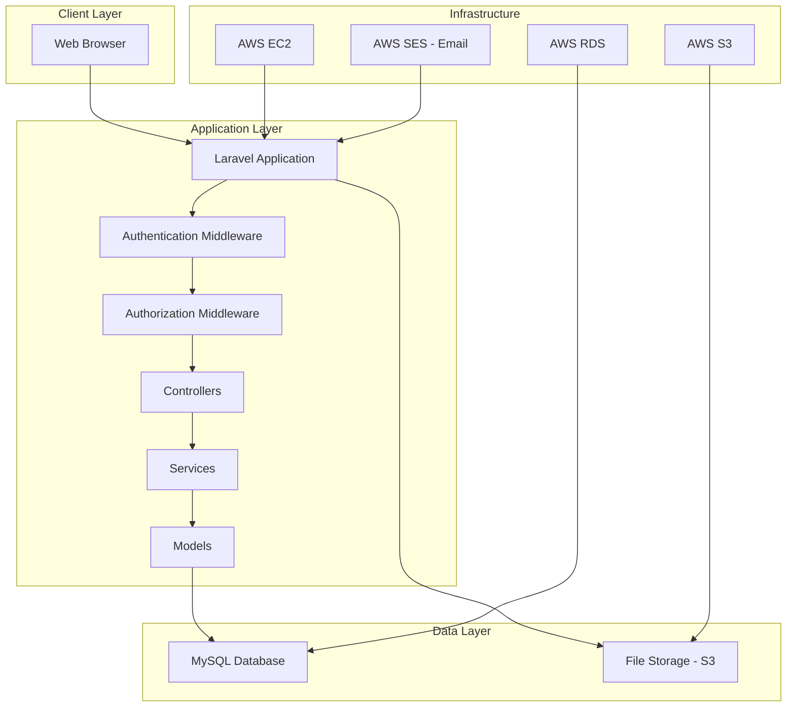

# Design Document

## Overview

Shise-Cal（施設カルテシステム）は、Laravel 9.x + AWS環境で構築するWebアプリケーションです。MVC アーキテクチャを採用し、ロールベースアクセス制御（RBAC）により権限管理を実現します。承認機能のON/OFF切り替え、CSV/PDF出力、ファイル管理、コメント・通知機能を提供します。

## Architecture

### System Architecture



### Technology Stack

- **Backend**: Laravel 9.x (PHP 8.1+)
- **Database**: MySQL 8.0
- **File Storage**: AWS S3
- **Email**: AWS SES
- **Infrastructure**: AWS EC2, RDS
- **Frontend**: Blade Templates + Bootstrap 5
- **Authentication**: Laravel Sanctum

### Environment Configuration

#### Local Development Environment
- **Runtime**: PHP 8.1 + Composer
- **Database**: MySQL 8.0 (Docker or local install)
- **File Storage**: Local storage (storage/app/public)
- **Email**: Laravel Log driver (no actual sending)
- **Web Server**: PHP built-in server or Laravel Valet

#### AWS Test Environment (Free Tier)
- **Infrastructure**: AWS EC2 t2.micro (Free Tier eligible)
- **Database**: MySQL 8.0 (EC2インスタンス内にインストール)
- **File Storage**: AWS S3 (Free Tier - 5GB)
- **Email**: AWS SES (sandbox mode - Free Tier)
- **Domain**: test-shisecal.example.com
- **SSL**: AWS Certificate Manager (無料)

#### AWS Production Environment
- **Infrastructure**: AWS EC2 t3.medium (Auto Scaling)
- **Database**: AWS RDS MySQL t3.small (Multi-AZ)
- **File Storage**: AWS S3 (production bucket with versioning)
- **Email**: AWS SES (production mode)
- **CDN**: AWS CloudFront
- **Load Balancer**: AWS Application Load Balancer
- **Domain**: shisecal.example.com
- **SSL**: AWS Certificate Manager
- **Backup**: Automated RDS snapshots + S3 cross-region replication

## Components and Interfaces

### Core Components

#### 1. User Management Component
- **UserController**: ユーザーCRUD操作
- **RoleService**: ロール・権限管理
- **AuthService**: 認証・認可処理

#### 2. Facility Management Component
- **FacilityController**: 施設情報CRUD操作
- **FacilityService**: 施設データ処理ロジック
- **ApprovalService**: 承認フロー管理

#### 3. File Management Component
- **FileController**: PDFアップロード・ダウンロード
- **FileService**: S3ファイル操作
- **FileRepository**: ファイルメタデータ管理

#### 4. Export Component
- **ExportController**: CSV/PDF出力
- **CsvExportService**: CSV生成・出力
- **PdfExportService**: PDF帳票生成
- **FavoriteService**: お気に入り設定管理

#### 5. Comment & Notification Component
- **CommentController**: コメント管理
- **NotificationService**: 通知処理
- **EmailService**: メール送信

#### 6. Maintenance History Component
- **MaintenanceController**: 修繕履歴管理
- **MaintenanceService**: 履歴データ処理

### Interface Definitions

#### API Endpoints Structure

```
/admin/
  - users (ユーザー管理)
  - settings (システム設定)
  - logs (ログ管理)

/facilities/
  - index (施設一覧)
  - show/{id} (施設詳細)
  - create (新規登録)
  - edit/{id} (編集)
  - delete/{id} (削除)

/export/
  - csv (CSV出力)
  - pdf (PDF出力)
  - favorites (お気に入り管理)

/files/
  - upload (アップロード)
  - download/{id} (ダウンロード)

/comments/
  - store (コメント投稿)
  - update-status (ステータス更新)

/maintenance/
  - index (履歴一覧)
  - store (履歴登録)

/annual-check/
  - request (年次確認依頼)
  - respond (確認回答)
```

## Data Models

### Core Entities

#### Users Table
```sql
users (
    id: bigint PRIMARY KEY,
    email: varchar(255) UNIQUE,
    password: varchar(255),
    role: enum('admin', 'editor', 'primary_responder', 'approver', 'viewer'),
    name: varchar(255),
    department: varchar(255),
    access_scope: json, -- 閲覧権限範囲
    is_active: boolean DEFAULT true,
    created_at: timestamp,
    updated_at: timestamp
)
```

#### Facilities Table
```sql
facilities (
    id: bigint PRIMARY KEY,
    company_name: varchar(255),
    office_code: varchar(20),
    designation_number: varchar(50),
    facility_name: varchar(255),
    postal_code: varchar(10),
    address: text,
    phone_number: varchar(20),
    fax_number: varchar(20),
    status: enum('draft', 'pending_approval', 'approved'),
    approved_at: timestamp NULL,
    approved_by: bigint NULL,
    created_by: bigint,
    updated_by: bigint,
    created_at: timestamp,
    updated_at: timestamp,
    FOREIGN KEY (approved_by) REFERENCES users(id),
    FOREIGN KEY (created_by) REFERENCES users(id),
    FOREIGN KEY (updated_by) REFERENCES users(id)
)
```

#### Files Table
```sql
files (
    id: bigint PRIMARY KEY,
    facility_id: bigint,
    original_name: varchar(255),
    file_path: varchar(500),
    file_size: bigint,
    mime_type: varchar(100),
    file_type: enum('contract', 'blueprint', 'inspection', 'other'),
    uploaded_by: bigint,
    created_at: timestamp,
    updated_at: timestamp,
    FOREIGN KEY (facility_id) REFERENCES facilities(id),
    FOREIGN KEY (uploaded_by) REFERENCES users(id)
)
```

#### Comments Table
```sql
comments (
    id: bigint PRIMARY KEY,
    facility_id: bigint,
    field_name: varchar(100), -- コメント対象項目
    content: text,
    status: enum('pending', 'in_progress', 'resolved'),
    posted_by: bigint,
    assigned_to: bigint NULL, -- 一次対応者
    resolved_at: timestamp NULL,
    created_at: timestamp,
    updated_at: timestamp,
    FOREIGN KEY (facility_id) REFERENCES facilities(id),
    FOREIGN KEY (posted_by) REFERENCES users(id),
    FOREIGN KEY (assigned_to) REFERENCES users(id)
)
```

#### Maintenance History Table
```sql
maintenance_histories (
    id: bigint PRIMARY KEY,
    facility_id: bigint,
    maintenance_date: date,
    content: text,
    cost: decimal(10,2) NULL,
    contractor: varchar(255) NULL,
    created_by: bigint,
    created_at: timestamp,
    updated_at: timestamp,
    FOREIGN KEY (facility_id) REFERENCES facilities(id),
    FOREIGN KEY (created_by) REFERENCES users(id)
)
```

#### Export Favorites Table
```sql
export_favorites (
    id: bigint PRIMARY KEY,
    user_id: bigint,
    name: varchar(255),
    facility_ids: json, -- 選択施設ID配列
    export_fields: json, -- 出力項目配列
    created_at: timestamp,
    updated_at: timestamp,
    FOREIGN KEY (user_id) REFERENCES users(id)
)
```

#### System Settings Table
```sql
system_settings (
    id: bigint PRIMARY KEY,
    key: varchar(100) UNIQUE,
    value: text,
    description: text NULL,
    updated_by: bigint,
    created_at: timestamp,
    updated_at: timestamp,
    FOREIGN KEY (updated_by) REFERENCES users(id)
)
```

#### Activity Logs Table
```sql
activity_logs (
    id: bigint PRIMARY KEY,
    user_id: bigint,
    action: varchar(100), -- 'create', 'update', 'delete', 'approve', etc.
    target_type: varchar(100), -- 'facility', 'user', 'file', etc.
    target_id: bigint NULL,
    description: text,
    ip_address: varchar(45),
    user_agent: text,
    created_at: timestamp,
    FOREIGN KEY (user_id) REFERENCES users(id)
)
```

### Relationships

- Users 1:N Facilities (created_by, updated_by, approved_by)
- Facilities 1:N Files
- Facilities 1:N Comments
- Facilities 1:N Maintenance Histories
- Users 1:N Export Favorites
- Users 1:N Activity Logs

### Database Migration Strategy

データベースモデルは開発過程で変更可能です：

#### Migration Management
- **Laravel Migrations**: スキーマ変更の履歴管理
- **Rollback Support**: 変更の巻き戻し機能
- **Environment Sync**: 開発・テスト・本番環境の同期

#### Schema Change Process
1. **Development**: ローカル環境でmigration作成・テスト
2. **Testing**: テスト環境でmigration実行・検証
3. **Production**: 本番環境でmigration実行（メンテナンス時間内）

#### Change Types Supported
- **Column Addition**: 新しいカラムの追加
- **Column Modification**: データ型・制約の変更
- **Index Management**: インデックスの追加・削除
- **Table Creation**: 新しいテーブルの追加
- **Relationship Changes**: 外部キー制約の変更

#### Data Migration
- **Seeder Updates**: マスターデータの更新
- **Data Transformation**: 既存データの変換処理
- **Backup Strategy**: 変更前のデータバックアップ

## Error Handling

### Error Categories

1. **Authentication Errors**
   - 401 Unauthorized: ログイン失敗
   - 403 Forbidden: IP制限違反

2. **Authorization Errors**
   - 403 Forbidden: 権限不足
   - 404 Not Found: アクセス権限のないリソース

3. **Validation Errors**
   - バリデーションは実施しないため、基本的にはなし
   - ファイルサイズ制限のみチェック

4. **System Errors**
   - 500 Internal Server Error: システムエラー
   - 503 Service Unavailable: メンテナンス中

### Error Response Format

```json
{
    "success": false,
    "message": "エラーメッセージ",
    "error_code": "ERROR_CODE",
    "data": null
}
```

### Logging Strategy

- **Application Logs**: Laravel Log (daily rotation)
- **Access Logs**: Nginx access logs
- **Activity Logs**: Database table (user actions)
- **Error Logs**: Laravel Log + CloudWatch

## Testing Strategy

### Testing Levels

#### 1. Unit Testing
- **Models**: Eloquent relationships, scopes
- **Services**: Business logic, data processing
- **Utilities**: Helper functions, formatters

#### 2. Feature Testing
- **Controllers**: HTTP requests/responses
- **Authentication**: Login, logout, role-based access
- **File Operations**: Upload, download, storage

#### 3. Integration Testing
- **Database**: Migration, seeding, queries
- **External Services**: S3 file operations, SES email
- **API Endpoints**: Full request/response cycle

#### 4. Browser Testing (Manual)
- **User Workflows**: Complete user journeys
- **Cross-browser**: Chrome, Firefox, Safari, Edge
- **Responsive**: Desktop only (as per requirements)

### Test Data Strategy

#### Seeders
- **UserSeeder**: 各ロールのテストユーザー
- **FacilitySeeder**: サンプル施設データ
- **SystemSettingSeeder**: デフォルト設定値

#### Factories
- **UserFactory**: ランダムユーザー生成
- **FacilityFactory**: ランダム施設データ
- **CommentFactory**: テストコメント
- **MaintenanceHistoryFactory**: 修繕履歴データ

### Testing Tools

- **PHPUnit**: Unit & Feature testing
- **Laravel Dusk**: Browser testing (if needed)
- **Faker**: Test data generation
- **Mockery**: Mocking external services

### CI/CD Testing Pipeline

1. **Code Quality**: PHP CS Fixer, PHPStan
2. **Unit Tests**: PHPUnit with coverage
3. **Feature Tests**: Database integration
4. **Security**: Composer audit
5. **Performance**: Basic load testing

### Test Coverage Goals

- **Unit Tests**: 80%+ coverage
- **Feature Tests**: All API endpoints
- **Critical Paths**: 100% coverage (auth, file operations, approvals)